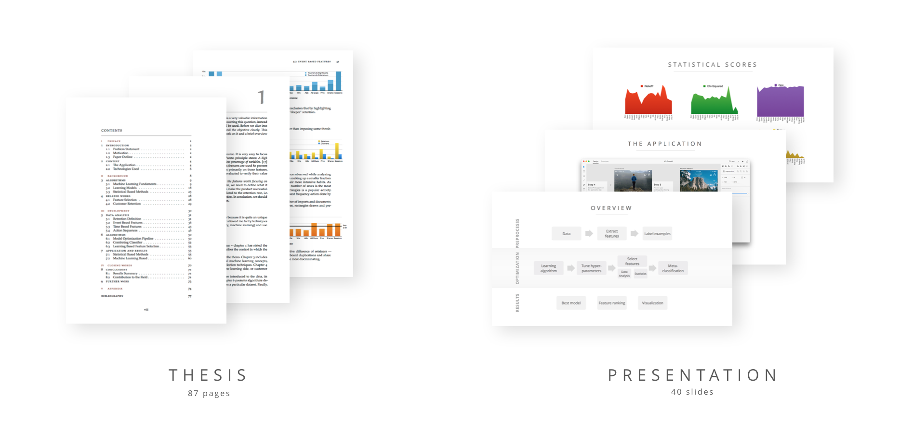

# undergrad-thesis
My Bachelor's Thesis project.

**Abstract**
> Making a decision on what to invest development time in is dif- ficult. Today’s market is so competitive that you cannot afford to focus on negligible product features. Based on reported customer behavior, I propose a ranking of the most important features with the help of statistics and machine learning. Following this advice leads to making informed decisions leading to good use of developers’ time.

The [thesis presentation](https://github.com/stefan1niculae/undergrad-thesis/blob/master/Presentation.pdf) is available, in english. A [shortened version](https://github.com/stefan1niculae/undergrad-thesis/blob/master/Presentation%20short.pdf) (in romanian) is also linked.

For more details, you can consult the [full-length paper](https://github.com/stefan1niculae/undergrad-thesis/blob/master/Paper.pdf). It is written in english, except for the cover page and a two-page summary written in romanian.

Code is unavailable to the public as the thesis was developed while working at Adobe.
